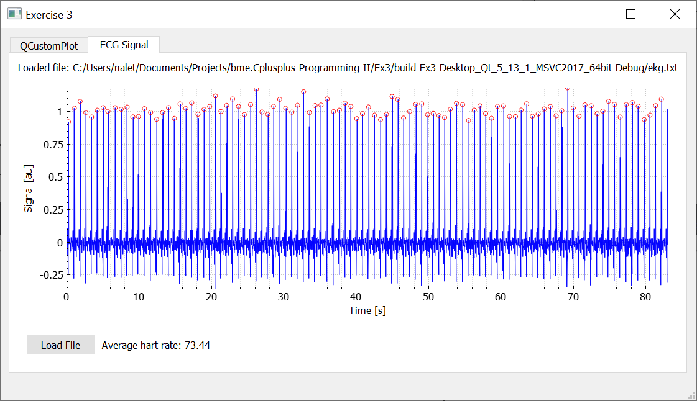

# bme.Cplusplus-Programming-II

## Output Ex1 ##

    ///////////////////////////////////////////////////////////////
    ///              BME - C++ II - EXERCISE 1                  ///
    ///////////////////////////////////////////////////////////////

    ***************************************************************
    ***                          STL 1                          ***
    ***************************************************************
    a b c d e f g h i j k l m n o p q r s t u v w x y z
    z y x w v u t s r q p o n m l k j i h g f e d c b a
    ***************************************************************
    ***                          STL 2                          ***
    ***************************************************************
    Daimler Puch Steyr Denzel Porsche Holden FN Excelsior Imperia Metallurgique Aero Willys Russel-Knight Skoda Tatra DKW Horch Wanderer BMW Hansa Lloyd Borgward Goliath Mercedes Benz NSU Lutzmann Opel Audi Volkswagen Adler Hannomag Zundapp IFA Wartburg Trabant Anglo-Dane JAN Hispano-Suiza SEAT Peugeot Renault Citroen Simca Ducati Talbot Austin Bentley Frazer Nash Hillman Humber Jaguar Land Rover MG Morris Riley Morgan Rolls-Royce Rover Singer Triumph Alfa Romeo Ferrari Fiat Lancia Maserati Lamborgini Mitsubishi Mazda Datsun Nissan Subaru Susuki Toyota Hyundai Kia DAF Hong-Chi Volga Moskovitch Tchaika ZIL Rambler Nash Hudson Chrysler Dodge Plymouth Checker Edsel Lincoln Ford Buick Cadillac Chevrolet Oldsmobile Pontiac Studebaker Saab Volvo

    Adler Aero Alfa Anglo-Dane Audi Austin BMW Bentley Benz Borgward Buick Cadillac Checker Chevrolet Chrysler Citroen DAF DKW Daimler Datsun Denzel Dodge Ducati Edsel Excelsior FN Ferrari Fiat Ford Frazer Goliath Hannomag Hansa Hillman Hispano-Suiza Holden Hong-Chi Horch Hudson Humber Hyundai IFA Imperia JAN Jaguar Kia Lamborgini Lancia Land Lincoln Lloyd Lutzmann MG Maserati Mazda Mercedes Metallurgique Mitsubishi Morgan Morris Moskovitch NSU Nash Nash Nissan Oldsmobile Opel Peugeot Plymouth Pontiac Porsche Puch Rambler Renault Riley Rolls-Royce Romeo Rover Rover Russel-Knight SEAT Saab Simca Singer Skoda Steyr Studebaker Subaru Susuki Talbot Tatra Tchaika Toyota Trabant Triumph Volga Volkswagen Volvo Wanderer Wartburg Willys ZIL Zundapp
    ***************************************************************
    ***                          STL 3                          ***
    ***************************************************************
    Adler Aero Alfa Anglo-Dane Audi Austin

    Adler Aero Alfa Anglo-Dane Audi Austin
    ***************************************************************
    ***                          STL 4                          ***
    ***************************************************************
    Adler Aero Alfa Anglo-Dane Audi Austin BMW Bentley Benz Borgward Buick Cadillac Checker Chevrolet Chrysler Citroen
    ***************************************************************
    ***                    istream_iterators                    ***
    ***************************************************************
    End the input in Linux with CTRL-D.
    In Windows press <Enter> CTRL-Z <Enter>.
    Please enter some text: a a b only unique words are are stored
    ^Z

    a are b only stored unique words

## Output Ex2 ##

    ///////////////////////////////////////////////////////////////
    ///              BME - C++ II - EXERCISE 2                  ///
    ///////////////////////////////////////////////////////////////

    ***************************************************************
    ***                            2a                           ***
    ***************************************************************
    Enter name (or Exit ): Homer
    Phone number: 1111
    Enter name (or Exit ): Exit

    ***************************************************************
    ***                            2b                           ***
    ***************************************************************
    Enter name (or Exit ): Homer
    Phone numbers: 1111, 1111,
    Enter name (or Exit ): Exit

    ***************************************************************
    ***                            3                            ***
    ***************************************************************
    Australia: 5 billionaires. Richest is Gina Rinehart with 17.4 B$
    Austria: 2 billionaires. Richest is Dietrich Mateschitz with 23 B$
    Belgium: 1 billionaires. Richest is Albert Frere with 6.2 B$
    Brazil: 9 billionaires. Richest is Jorge Paulo Lemann with 27.4 B$
    Canada: 7 billionaires. Richest is David Thomson with 25 B$
    Chile: 1 billionaires. Richest is Iris Fontbona with 16.3 B$
    China: 40 billionaires. Richest is Ma Huateng with 45.3 B$
    Colombia: 1 billionaires. Richest is Luis Carlos Sarmiento with 12.1 B$
    Cyprus: 1 billionaires. Richest is John Fredriksen with 7 B$
    Czech Republic: 1 billionaires. Richest is Petr Kellner with 15.5 B$
    Denmark: 5 billionaires. Richest is Anders Holch Povlsen with 7.4 B$
    Egypt: 1 billionaires. Richest is Nassef Sawiris with 6.6 B$
    France: 15 billionaires. Richest is Bernard Arnault with 72 B$
    Germany: 30 billionaires. Richest is Beate Heister & Karl Albrecht Jr. with 29.8 B$
    Hong Kong: 19 billionaires. Richest is Li Ka-shing with 34.9 B$
    India: 20 billionaires. Richest is Mukesh Ambani with 40.1 B$
    Indonesia: 3 billionaires. Richest is R. Budi Hartono with 17.4 B$
    Ireland: 2 billionaires. Richest is Pallonji Mistry with 17.8 B$
    Israel: 3 billionaires. Richest is Eyal Ofer with 9.4 B$
    Italy: 7 billionaires. Richest is Giovanni Ferrero with 23 B$
    Japan: 6 billionaires. Richest is Masayoshi Son with 22.7 B$
    Malaysia: 5 billionaires. Richest is Robert Kuok with 14.8 B$
    Mexico: 7 billionaires. Richest is Carlos Slim Helu with 67.1 B$
    Netherlands: 2 billionaires. Richest is Charlene de Carvalho-Heineken with 15.8 B$
    New Zealand: 1 billionaires. Richest is Graeme Hart with 10.1 B$
    Nigeria: 2 billionaires. Richest is Aliko Dangote with 14.1 B$
    Norway: 1 billionaires. Richest is Odd Reitan with 6.6 B$
    Philippines: 2 billionaires. Richest is Henry Sy with 20 B$
    Portugal: 1 billionaires. Richest is Maria Fernanda Amorim with 5.1 B$
    Russia: 22 billionaires. Richest is Vladimir Lisin with 19.1 B$
    Singapore: 4 billionaires. Richest is Robert & Philip Ng with 10.8 B$
    South Africa: 2 billionaires. Richest is Nicky Oppenheimer with 7.7 B$
    South Korea: 6 billionaires. Richest is Lee Kun-Hee with 18.6 B$
    Spain: 2 billionaires. Richest is Amancio Ortega with 70 B$
    Sweden: 9 billionaires. Richest is Stefan Persson with 16.8 B$
    Switzerland: 9 billionaires. Richest is Gianluigi & Rafaela Aponte with 9.3 B$
    Taiwan: 3 billionaires. Richest is Terry Gou with 8.5 B$
    Thailand: 2 billionaires. Richest is Charoen Sirivadhanabhakdi with 17.9 B$
    Ukraine: 1 billionaires. Richest is Rinat Akhmetov with 5.5 B$
    United Arab Emirates: 1 billionaires. Richest is Abdulla bin Ahmad Al Ghurair with 5.9 B$
    United Kingdom: 14 billionaires. Richest is Hinduja family with 19.5 B$
    United States: 125 billionaires. Richest is Jeff Bezos with 112 B$

## Output Ex3 ##

## Output Ex4 ##

    ///////////////////////////////////////////////////////////////
    ///              BME - C++ II - EXERCISE 4                  ///
    ///////////////////////////////////////////////////////////////

    8 concurrent threads are supported.

    ***************************************************************
    ***                   Thread basics                         ***
    ***************************************************************
    finished Thread basics. Written data to threadLog.txt

    ***************************************************************
    ***                      Data Races                         ***
    ***************************************************************
    finished Data Races. Written data to threadSaveLog.txt

## Output Ex5 ##

    ///////////////////////////////////////////////////////////////
    ///              BME - C++ II - EXERCISE 5                  ///
    ///////////////////////////////////////////////////////////////

    ***************************************************************
    ***                Consumer/Producer Pattern                ***
    ***************************************************************
    Producing --> item 0
    item 0 --> comsumed
    Producing --> item 1
    item 1 --> comsumed
    Producing --> item 2
    Producing --> item 3
    item 2 --> comsumed
    Producing --> item 4
    item 3 --> comsumed
    Producing --> item 5
    Producing --> item 6
    item 4 --> comsumed
    Producing --> item 7
    item 5 --> comsumed
    Producing --> item 8
    Producing --> item 9
    item 6 --> comsumed
    Producing --> item 10
    item 7 --> comsumed
    Producing --> item 11
    Producing --> item 12
    item 8 --> comsumed
    Producing --> item 13
    item 9 --> comsumed
    Producing --> item 14
    item 10 --> comsumed
    Producing --> item 15
    item 11 --> comsumed
    Producing --> item 16
    item 12 --> comsumed
    Producing --> item 17
    item 13 --> comsumed
    Producing --> item 18
    item 14 --> comsumed
    Producing --> item 19
    item 15 --> comsumed
    Producing --> item 20
    item 16 --> comsumed
    Producing --> item 21
    item 17 --> comsumed
    Producing --> item 22
    item 18 --> comsumed
    Producing --> item 23
    item 19 --> comsumed
    Producing --> item 24
    --- Producer done ----
    item 20 --> comsumed
    item 21 --> comsumed
    item 22 --> comsumed
    item 23 --> comsumed
    item 24 --> comsumed
    Finished!